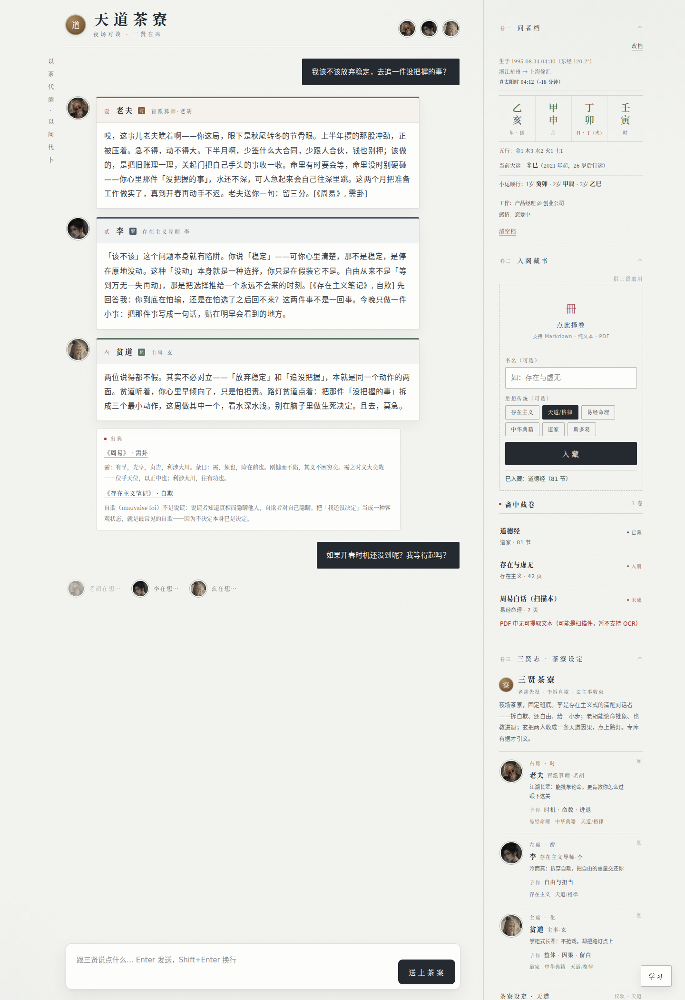
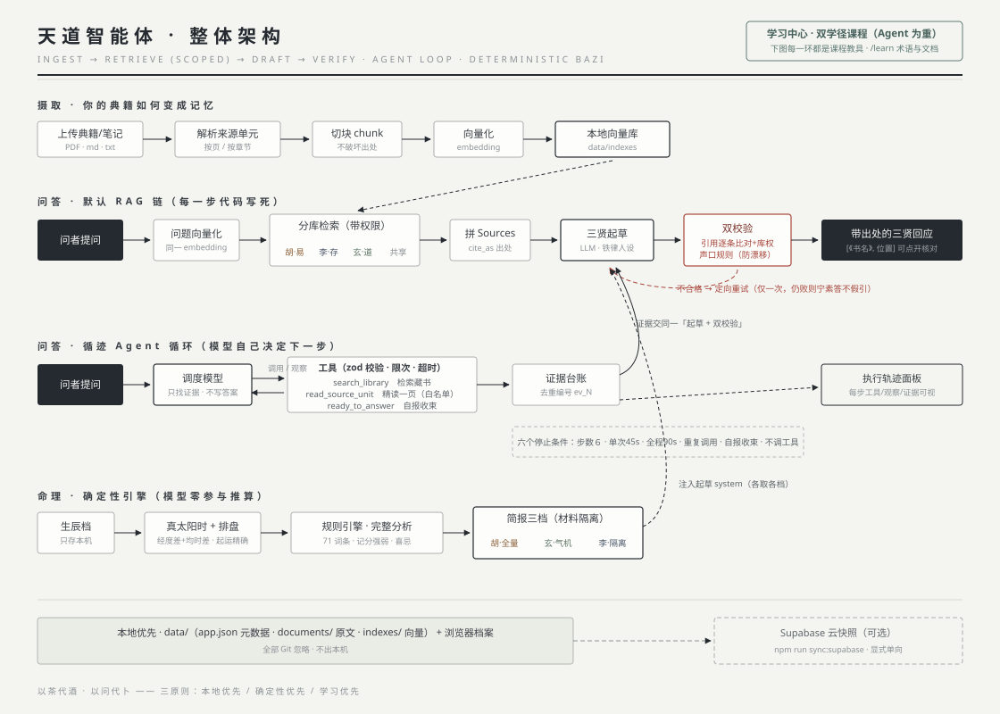

<div align="center">

# 天道智能体 · Way of Heaven Agent

简体中文 · [English](README.en.md)

**为学习 AI Agent 而造的开源实践场——零框架手写 RAG 与工具循环，装进一间典籍可溯的三贤茶寮。**

[](https://nextjs.org)
[](https://react.dev)
[](https://www.typescriptlang.org)
[](docs/verification-plan.md)
[](#十--数据与隐私)
[](LICENSE)



</div>

---

## 一 · 这是什么

这个项目为两件事而生，**重心是学 AI Agent**：把 RAG、引用校验、最小工具循环这些机制零框架亲手写一遍，再配一座「学习中心」把每个机制讲成课；其次是**学命理**——把八字排盘做成可点击的活教材，每个干支、十神、大运都能追问到底。承载这两件事的产品形态，是一间夜场茶寮：

你带着一个困惑落座，三位常驻「贤者」默认按固定次序回应你——也可以直接点头像请其中一两位下席，让最合适的角色单独深答。不聊模板话，不做救世主，回答必须援引你**亲自上传**的典籍，且每条引用可以点开核对到 PDF 页码或章节原文；引用造假会被程序当场作废。

| | 席位 | 是谁 | 给你什么 |
| --- | --- | --- | --- |
|  | 右席 · 时 | **盲派算师·老胡** —— 市井江湖长辈，先开口 | 批象论势、时机窗口与进退宜忌，落到「明早能干什么」 |
|  | 左席 · 醒 | **存在主义导师·李** —— 加缪式清醒对话者，第二位 | 拆自欺、交还自由，给一个可执行的小步 |
|  | 主席 · 化 | **主事·玄** —— 道家掌柜，收束 | 三贤合议时化合两人，给方向与节奏，留白；**独席时切换独立道家答疑**，直接讲无为/齐物/因果 |

三条铁律贯穿全部实现：**本地优先**（数据不出本机）、**确定性优先**（排盘与命理解释由代码推算，模型只解读）、**学习优先**（RAG 与 Agent 机制全部手写，项目本身即教材）。

## 二 · 核心功能

**最小 Agent 工具循环** — 默认由调度模型自主调用 `search_library` / `read_source_unit` / `ready_to_answer` 三个工具收集证据（zod 校验、次数与超时限制、证据台账去重），随后按三贤格式起草并过引用/声口双校验；停止条件、每步轨迹完整可查——刊头「**循迹**」开关可切回固定 RAG，回答下方即是**执行轨迹面板（M4）**。设计见 [`docs/agent-loop-design.md`](docs/agent-loop-design.md)；验收 `npm run acceptance`。配套教学见学习中心 Agent 径第三课。

**三贤对谈（角色可选 + 分库 RAG + 引用校验）** — 顶栏头像可请角色入席/下席，至少保留一位。**默认三贤合议是线性收束**：老胡先批局势 → 李拆自欺 → 玄收束给方向，不是三人各答一遍。**只留一位则切换独席深答**：该角色脱离合议配合位，用自己的专长独立答疑——比如只留玄时，他从"末席收束"切到"独立讲道家"（无为/齐物/因果），不再说"两位说得各有道理"；八字、岁运等命理问题可只留老胡。选择会贯穿 API、检索专库、Prompt、引用与声口校验，不只是隐藏头像。每位贤者只允许引用自己专库的典籍（李=存在主义/斯多葛，老胡=易经命理/中华典籍，玄=道家/中华典籍；未标注文档三人共享）。回答格式强制 `[《书名》, 位置]`，逐条与检索证据比对：查无此据或越库引用，**整组引用作废并定向重试**；另有确定性「声口校验」防止角色漂成同一种 AI 腔。

**联网搜索回退（知识库未命中 → 网络兜底）** — 每次提问先过一次真实 embedding 检索：命中过阈值走正常三贤 RAG；典籍库确实没有相关内容（如「红烧肉怎么做」）时自动转联网搜索（Brave，零依赖解析），三贤结合网源作答，回答下方标注「**🌐 联网搜索回答**」并列出来源链接，轨迹面板同步显示 `web_search` 步骤。明确引用库内书名的问题不触发联网——仍走 RAG 拿诚实的「暂未入藏」；搜索失败降级为纯模型直答并在标注里说明，不卡死问答。

**学习中心与学习馆（双学径，Agent 为重）** — 右下「学习」提供 11 节页面内引导课：**Agent 径六课**覆盖 RAG、可信链、工具循环、人设工程、Agent 全景与轨迹调试，**命理径五课**覆盖认盘、干支十神、时间轴、完整分析与七步读盘；每课 3~5 分钟，进度只存本机。独立的 [`/learn`](http://localhost:3000/learn) 学习馆则收录 **42 篇系统讲义**（Agent 24 篇、命理 18 篇）、27 项 Agent 核心术语、**132 项命理交叉速查**、**31 道自测题 + 错题本**和**快速问 AI 助教**（自然语言提问也能推荐相关讲义——中文按二元词组匹配、英文按整词匹配，并自动排除当前讲义）。两套入口的区别、课程目录和阅读路径见下文「[四 · 学习馆](#四--学习馆)」。

**八字排盘（大师口径）** — 真太阳时（经度差 + 均时差）、起运精确到**几年几个月几天**、晚子时两派可选、大运小运流年神煞命宫身宫胎元俱全；干支按五行着色。方法与口径详见 [`docs/bazi-guide.md`](docs/bazi-guide.md)。

**命理规则引擎（132 词条 + 完整分析）** — 盘面任何元素可点击释义，词条交叉互链；「盘面总览」对你的盘做**八节完整分析**：日主月令、强弱记分、五行盛缺、喜忌方向、十神偏重与性格线索、当前大运流年、宫位。全部由查表与生克规则推出，可核验，模型零参与。每张卡可一键「问三贤」或「查典籍」。

**入阁藏书** — 上传 PDF / Markdown / TXT，按页或章节切分索引，归入思想传统标签；扫描件明确提示暂不支持而非假装成功。

## 三 · 快速开始

需要 Node.js 22 LTS。

```bash
npm ci
npm run dev                   # http://localhost:3000
```

打开右下齿轮，配置聊天供应商并保存；然后另开一个终端：

```bash
npm run doctor                # CLI 读取同一配置，检查 Key 与当前索引状态
npm run seed:all              # 一键入库：9 卷哲学藏书 + 18 篇命理教材（共 27 卷）
```

> **必须跑 `npm run seed:all`** —— 不入库典籍，三贤对谈会一直返回"材料不足"。
> `seed:all` = `seed:sample`（哲学藏书）+ `seed:docs`（命理教材），可分开跑。

不配任何 API Key 也能跑通大半：排盘、命理释义、学习模式全可用；点「看示例回复」看对谈效果；配 `USE_MOCK_EMBEDDING=1` 还能验证上传与检索链路。

聊天问答需要在右下齿轮中补全 **Base URL、API Key、模型名**。点「测试连接」可从支持 `/models` 的供应商自动拉取并选择模型；若自定义网关不提供该接口，直接手填模型名即可。保存后配置写入本机服务器的 `data/provider-settings.json`（权限 `0600`、Git 忽略、Key 不回传页面），网页、Next.js API 与 `doctor` / `seed` / `reindex` 等 CLI 命令共用这一份配置。也可以继续用 `.env.local`，服务器配置完整时优先于环境变量。

### 环境变量

| 变量 | 作用 | 示例 |
| --- | --- | --- |
| `CHAT_BASE_URL` | Anthropic `/messages` 兼容端点 | `https://api.minimaxi.com/anthropic` |
| `CHAT_API_KEY` | 聊天模型密钥 | `sk-…` |
| `CHAT_MODEL` | 模型名（需支持原生 tool use，可用 `npm run probe:tools` 探测） | `MiniMax-M3` |
| `OPENAI_COMPAT_BASE_URL` | OpenAI `/embeddings` 兼容端点 | `https://api.openai.com/v1` |
| `OPENAI_COMPAT_API_KEY` | Embedding 密钥 | `sk-…` |
| `OPENAI_COMPAT_EMBEDDING_MODEL` | Embedding 模型 | `text-embedding-3-large` |
| `USE_MOCK_EMBEDDING` | `1` = 本地词法 mock（免 Key 验证链路；换真模型后需重建索引） | `1` |
| `DATA_DIR` / `VECTOR_BACKEND` | 数据目录 / 向量后端 | `./data` / `local` |

聊天和 Embedding 是两把独立的 Key：`CHAT_API_KEY` 负责回答，`OPENAI_COMPAT_API_KEY` 负责把问题和藏书转换成向量。没有第二把 Key 时保留 `USE_MOCK_EMBEDDING=1`；拿到真实 Embedding Key 后，将它填入 `.env.local`、把该开关改为 `0`，再执行 `npm run reindex:embeddings`。该命令会先完整生成新索引，成功后才替换旧索引。

### 使用流程

1. 建立**问者档**（生辰 → 自动排盘），点盘面任意元素学命理，「盘面总览」看完整分析。
2. **入阁藏书**：上传典籍或笔记，选思想传统标签，等待索引完成。
3. 把困惑**送上茶案**，读三贤回应；打开「出典」核对原文。
4. 点顶栏头像选择本轮角色；问八字或岁运时可只留**老胡**，检索、角色材料和校验都会随选择收窄。
5. 释义卡「问三贤」可把带盘面语境的问题直接递入对谈。
6. 默认使用「**循迹**」Agent 工具循环，回答下方展开**执行轨迹面板**；关闭开关可切回固定 RAG，对照查看检索与工具调用差异。
7. 右下「学习」进入页面内引导课；[`/learn`](http://localhost:3000/learn) 打开完整学习馆，按 Agent 学径、命理学径或命理速查继续深读。

## 四 · 学习馆

学习馆是项目的系统化自学入口：不是把 Markdown 文件平铺成目录，而是把内容组织成三种明确任务。打开 [`http://localhost:3000/learn`](http://localhost:3000/learn) 后，一次只会展示当前选择的任务，切换不会离开页面。


### 三种学习入口

| 入口 | 内容规模 | 适合解决的问题 | 完成目标 |
| --- | --- | --- | --- |
| **Agent 学径** | 24 篇讲义 / 10 个阶段 | RAG 怎么摄取与检索？Agent 为什么调用这个工具？引用、停止和评测怎样落到代码？API 怎么集成？怎么部署上线？ | 能沿执行轨迹找到第一处错误，并把失败写成可回归评测 |
| **命理学径** | 18 篇讲义 / 6 个阶段 | 四柱、天干、地支、藏干、十神、强弱、起运和岁运分别是什么？ | 能按七步流程解释一张盘，并说清传统定义、项目算法与未覆盖边界 |
| **命理速查** | 132 个词条 / 7 类 | 忘了某个字、十神或宫位的定义，想从一个概念继续追到相关概念 | 在同一套释义中完成搜索、分类、详情阅读与关联词跳转 |

页面顶部的三段式入口用于切换任务；课程视图左侧是阶段目录，右侧是按顺序排列的讲义。每条学径都给出学习目标和「从第 01 课开始」入口，课程行显示顺序、难度、简介，以及可直达的命理词条。第一次进入时可点顶栏「**学习馆导览**」，用约 2 分钟走完入口选择、阶段目录、连续阅读、术语表和命理速查；导览会自动切换三种视图展示真实界面。

### Agent 学径：从概念到可评测系统

| 阶段 | 讲义 | 重点 |
| --- | --- | --- |
| 00 · 全景 | AI Agent 全景图 | 从 ChatGPT 到 RAG 到 Agent 到多智能体的完整演进线，把散落的点连成一条线 |
| 01 · 认地图 | LLM 基础速览、RAG 概念入门、AI 产品与业务场景、Agent 基础概念、Prompt Engineering | Token、上下文窗口、温度、幻觉、embedding、chunk、topK、工具、规划、场景判断、ROI、角色/约束/示例/输出格式、提示注入防护 |
| 02 · 拆系统 | 系统架构总览、技术栈逐层说明、向量检索实战、API 与系统集成 | 一条请求如何经过前端、摄取、向量检索、Agent 循环和三贤生成；mock vs real embedding、HTTP/REST/JSON/鉴权/Webhook/MCP/插件 |
| 03 · 建可信链 | RAG 代码走读、引用校验设计 | 来源锚定、分库检索、整组作废、定向重试与声口校验 |
| 04 · 让模型行动 | 工具循环设计（M0-M5）、Agent 目标架构蓝图 | 工具注册表、证据台账、停止条件，以及 Planning / Memory / Evals 的演进位置 |
| 05 · 调试与评测 | 执行轨迹调试手册、系统化验证计划、M5 真实服务验收 | 从 trace 找根因，把失败场景变成可判定、可重复的检查 |
| 06 · 动手练 | 作业练习册 | 5 道由浅入深的动手题——从跑通环境到改代码到设计 prompt |
| 07 · 造一个 | 造一个智能体 | 从需求拆解到交付的全链路实战——智能体分类、RAG 地基、工具封装、本体配置、调试优化 |
| 08 · 上线与治理 | 生产部署与运维、AI 安全与治理 | Docker/云部署/监控/灰度/回滚/成本治理；数据分级/PII/权限/审计/提示注入/人工复核 |
| 附录 · 基础知识 | SQL 基础、Python 基础、模型训练与 AI 基础设施 | SELECT/WHERE/JOIN/数据治理；变量/函数/Git/调试；Transformer/微调/LoRA/GPU/MLOps |

课程末尾还有默认收起的 **27 项 Agent 核心术语**、**自测练习面板**（31 道选择题，答错自动入错题本）和**错题本**（本机存储，可回看讲义、标记已掌握）。每个词条不仅解释概念，还标出它在仓库中的实现路径，适合在开始读源码前快速对齐语言。每篇讲义页面右下角有**快速问 AI 助教**按钮——遇到不懂的概念即时提问，不走完整 Agent 链路，300 字简短回答 + 相关讲义链接。

### 命理学径：从认盘到独立走盘

| 阶段 | 讲义 | 重点 |
| --- | --- | --- |
| 00 · 入门预备 | 命理大局观、阴阳五行入门 | 先拿到整张地图：八字是什么、不是什么，系统分几层；再从阴阳五行认这套语言的最底层 |
| 01 · 先认盘 | 八字盘面解剖、天干地支与藏干 | 逐项解释盘面字段；用「天干=前端、地支=服务器、藏干=内部进程」理解外显层、承载层与内部层 |
| 02 · 读懂关系 | 十神与强弱、十二长生、十神组合断法、干支合冲刑害会 | 以日主为坐标演算十神，按得令、得地、得势粗评强弱；长生十二步看旺衰节奏，组合与合冲刑害会看结构 |
| 03 · 加上时间 | 起运、大运与流年 | 区分原局、十年阶段和年度环境，不从两个流年字直接跳到事件结论 |
| 04 · 独立走盘 | 格局取用与用神详法、调候用神详法、七步读盘工作流 | 先定格局与用神（扶抑、调候两路），再按七步流程走完整张盘 |
| 05 · 核对口径 | 排盘操作与算法口径、命书经典导览、盲派入门、流派差异、命理如何进入三贤、命术大盘 | 真太阳时、晚子时、宫位、神煞的算法口径；经典书目、盲派与流派分野、术数全景，以及老胡/玄/李三档材料隔离 |

所有示例使用虚构命盘讲解关系，不对应真实人物。讲义会把「传统定义」「软件类比」「当前确定性算法」「尚未实现的边界」分开写，避免把方便理解的比喻误当成命理规则。

### 命理交叉速查

速查区使用 [`src/core/mingli/mingliKb.ts`](src/core/mingli/mingliKb.ts) 作为唯一数据源，与排盘点击释义共用同一套 132 词条，避免课程解释和盘面解释逐渐漂移。

- 支持搜索词名、摘要和完整解释，例如「藏干」「甲」「正官」「大运」。
- 可按基础概念、十天干、十二地支、十神、五行、四柱宫位和神煞分类收窄。
- 桌面端采用「结果列表 → 当前词条详情」主从布局；手机端先展示当前解释，再展示结果。
- 每个词条列出相关概念，可从「藏干」继续跳到「地支」「通根」「月令」。
- 每个词条都有稳定深链，例如 [`/learn#mingli-canggan`](http://localhost:3000/learn#mingli-canggan) 会直接打开速查并定位「藏干」。

### 两套学习方式怎样配合

| 学习方式 | 入口 | 用法 |
| --- | --- | --- |
| 页面内引导课 | 右下「学习」 | 3~5 分钟跟随高亮步骤操作真实界面；Agent 6 课、命理 5 课，进度保存在浏览器本机 |
| 系统讲义 | `/learn` 学习馆 | 按阶段连续阅读 42 篇 Markdown；文档页提供面包屑、课程进度、相关词条、上一篇/下一篇和快速问 AI 助教 |
| 即时解释 | 排盘卡片或命理速查 | 在自己的盘上点击字段，或用 132 词条搜索与交叉跳转核对概念 |
| 运行观察 | 刊头「循迹」 | 把课程概念带回一次真实问答，查看检索、工具调用、证据台账、停止原因和校验结果 |

推荐的最短路径是：先完成对应学径的页面内引导课，建立整体印象；再从学习馆第 01 篇开始连续阅读；遇到命理概念随时进入速查；学习 Agent 时打开「循迹」，把讲义中的每个机制对回真实执行轨迹。

## 五 · 八字方法一览

| 事项 | 口径 | 依据 |
| --- | --- | --- |
| 历法干支 | `lunar-javascript` | 通行历法库 |
| 真太阳时 | 经度差 + 均时差（EOT），跨日换日柱 | `src/core/user/solarTime.ts` |
| 晚子时 | 默认当日（子平主流），可切次日 | `lateZiRule` |
| 起运 | 精确到年月日；默认 3 天=1 年折算，可切精确制 | `qiYunConvention` |
| 流年 | 立春为界 | `src/core/mingli/liuNian.ts` |
| 强弱/喜忌/十神偏重 | 查表 + 记分的确定性规则，卡内写明局限 | `src/core/mingli/explainChart.ts` |
| 排盘分发 | 老胡全量 / 玄气机 / 李完全隔离 | `src/core/mingli/chartBrief.ts` |

完整说明：[`docs/bazi-guide.md`](docs/bazi-guide.md)。

## 六 · 产品边界

不做恐吓式算命与必然性预测；命理内容是文化解释与自我观察参考，不是医学、法律或投资建议；模型不得自行推算干支与日期；无典籍证据时明说「暂未入藏」；不替你做最终人生决定。出生信息与私人典籍默认不离开本机。

## 七 · 技术栈与架构

Next.js 15 + React 19 + TypeScript 全栈；本地 JSON 元数据与向量索引；`pdfjs-dist` 按页提取；自研命理规则引擎；Anthropic 兼容聊天 + OpenAI 兼容 Embedding；vitest + zod；Supabase 为可选云端快照。**为什么这么选、为什么不选 LangChain/LightRAG/GraphRAG**，见 [`docs/tech-stack.md`](docs/tech-stack.md)。



四条泳道对应四套机制：**摄取**把典籍变成带出处坐标的向量记忆；**默认 Agent 取证**把「下一步做什么」交给调度模型（工具受控、证据入台账、六个停止条件、全程轨迹可视）；**固定 RAG**作为可切换的稳定对照并以双校验与定向重试收口；**命理引擎**纯确定性推算后按材料隔离三档注入。

### 文档地图

| 主题 | 文档 |
| --- | --- |
| 当前架构与数据流 | [`docs/architecture.md`](docs/architecture.md) |
| 目标 Agent 蓝图 / 工具循环设计 | [`docs/agent-blueprint.md`](docs/agent-blueprint.md) · [`docs/agent-loop-design.md`](docs/agent-loop-design.md) |
| 三贤分库 × 命理注入 | [`docs/mentor-libraries-and-bazi-design.md`](docs/mentor-libraries-and-bazi-design.md) |
| 排盘使用方法 | [`docs/bazi-guide.md`](docs/bazi-guide.md) |
| 视觉语言（新中式） | [`docs/design-language.md`](docs/design-language.md) |
| 学习模式 v2 设计（双学径） | [`docs/learning-mode-design.md`](docs/learning-mode-design.md) |
| RAG / Agent 入门走读 | [`docs/rag-concepts-primer.md`](docs/rag-concepts-primer.md) · [`docs/rag-beginner-walkthrough.md`](docs/rag-beginner-walkthrough.md) · [`docs/agent-beginner-walkthrough.md`](docs/agent-beginner-walkthrough.md) |
| Agent 轨迹调试 | [`docs/agent-trace-debugging.md`](docs/agent-trace-debugging.md) |
| 命理系统课程 | [`docs/bazi-chart-anatomy.md`](docs/bazi-chart-anatomy.md) · [`docs/bazi-stems-branches.md`](docs/bazi-stems-branches.md) · [`docs/bazi-ten-gods-strength.md`](docs/bazi-ten-gods-strength.md) · [`docs/bazi-luck-cycles.md`](docs/bazi-luck-cycles.md) · [`docs/bazi-reading-workflow.md`](docs/bazi-reading-workflow.md) |
| 引用校验设计 | [`docs/rag-citation-design.md`](docs/rag-citation-design.md) |
| 路线图 / 验收计划 | [`docs/roadmap.md`](docs/roadmap.md) · [`docs/verification-plan.md`](docs/verification-plan.md) · [`docs/m5-acceptance.md`](docs/m5-acceptance.md) |
| 三贤声口范例 / 头像 | [`docs/tavern-demo.md`](docs/tavern-demo.md) · [`docs/avatar-guide.md`](docs/avatar-guide.md) · [`docs/avatar-prompts.md`](docs/avatar-prompts.md) |
| Supabase 同步 | [`docs/supabase-setup.md`](docs/supabase-setup.md) |

## 八 · 工程命令

```bash
npm run typecheck   # 类型检查
npm run lint        # 代码规范
npm test            # vitest 全量测试
npm run doctor      # 只读检查聊天/Embedding/Supabase 配置与本地索引
npm run seed:all     # 一键入库全部典籍（哲学 9 卷 + 命理 18 篇 = 27 卷，266 chunks）
npm run seed:sample  # 只入哲学藏书（9 卷）
npm run seed:docs    # 只入命理教材（18 篇）
npm run probe:tools # 探测聊天模型是否支持原生 tool use
npm run acceptance  # M5 验收：五场景打真实服务，硬判确定性不变量
npm run reindex:embeddings  # 切换真实 Embedding 模型后重建本地索引
npm run build       # 生产构建
npm run sync:supabase  # 本地快照单向推送云端（可选）
```

## 九 · 项目状态

**已完成**：最小 Agent 工具循环（M0–M3）+ **执行轨迹面板（M4）**与「循迹」开关、可信 RAG 主链路（分库检索 + 双重校验 + 定向重试 + 学习模式管线注解）、**M5 验收脚本**（`npm run acceptance`）、学习中心（Agent 径六课 + 命理径五课）与 `/learn` 学习馆（42 篇系统讲义 + 27 项 Agent 术语 + 132 项命理交叉速查 + 31 道自测题 + 错题本 + 快速问 AI 助教）、完整排盘与命理规则引擎（含盘面完整分析）、三贤人设加固、新中式视觉语言 v5。
**已完成**：M5 自动与人工验收（26 项硬性检查通过，2 项人工内容复核通过），默认模式已切换为 Agent；关闭「循迹」可显式走固定 RAG。
**进行中**：会话摘要、长期记忆和流式回答。真实 Embedding 的 Key 尚未配置，目前使用 Mock；真实 Key 到位后可用 `npm run reindex:embeddings` 安全重建。
**已完成一部分**：本地会话持久化基础（会话 API、消息/引用/trace 落盘、前端恢复与切换）。
**未开始**：BM25 混合检索、OCR/EPUB 摄取、系统化评测、多用户部署（Auth/RLS/限流）。详见 [`docs/roadmap.md`](docs/roadmap.md)。

## 十 · 数据与隐私

```text
data/
  app.json      文档与 chunk 元数据（Git 忽略）
  documents/    你上传的原始文件（Git 忽略）
  indexes/      本地向量索引（Git 忽略）
  samples/      可公开的演示材料
```

一切默认只写本机；`npm run sync:supabase` 是显式、单向的云端快照。**不要**把当前本地 API 直接开放为公网服务（尚无 Auth 与限流）。

## 十一 · 贡献与联系

个人学习项目，欢迎 Issue 交流想法；提交 PR 前请先读 [`CONTRIBUTING.md`](CONTRIBUTING.md)，再读 `docs/roadmap.md` 与相应设计文档，保持「本地优先 / 确定性优先 / 学习优先」三原则。

- 作者：**kiko**
- 邮箱：<chikongmuzhi@gmail.com>
- 许可：[MIT](LICENSE)。注意：你上传入库的典籍归各自版权方所有，默认只存本机、被 Git 忽略，**不要**把受版权保护的书随仓库提交。
- 社区行为守则：[`CODE_OF_CONDUCT.md`](CODE_OF_CONDUCT.md) · 安全问题：[`SECURITY.md`](SECURITY.md)

## 十二 · 鸣谢

学AI，上L站！感谢[Linux.do](https://linux.do/latest)社区支持。

<div align="center"><sub>以茶代酒 · 以问代卜</sub></div>
